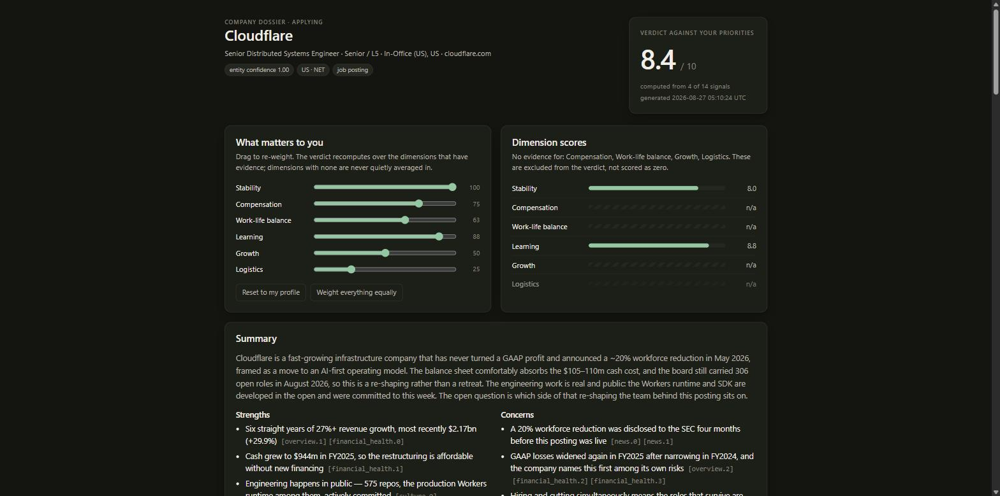

# company-research

Research a company before you apply, interview, or sign — inside the Claude Code or Codex
subscription you already pay for. No server, no MCP daemon, no API keys, no hosting.

You give your agent a job posting. You get back a single self-contained HTML dossier:
cited claims from free, keyless public sources, per-dimension scores, and a verdict you can
re-weight against your own priorities with a slider.



## Install

```bash
git clone https://github.com/xo-fr/company-research.git
cd company-research
python scripts/install_skill.py            # links the skill into Claude Code / Codex
export CR_CONTACT_EMAIL='you@example.com'  # SEC requires a contact in its User-Agent
python scripts/doctor.py                   # confirms every source is reachable
```

No remote script execution, no `curl | sh`. Python 3.10+; the standard library is enough
(`httpx` is used when installed, and never required).

`doctor.py` prints a live/degraded/dead line per source with a fix hint, and exits non-zero
if a core source is down — run it first, and again whenever a pillar comes back empty.

## Use

Paste this to your agent:

> Research this company for me before I apply: `<job posting URL>`

It asks at most four questions the first time (contact email, market and work
authorisation, resume path, priority order), writes `~/.company-research/profile.yaml`,
and then works. On later runs it asks two: the posting, and whether you are *applying*,
*interviewing*, or weighing an *offer*. The stage decides which pillars run:

| Stage | Pillars |
|---|---|
| `applying` | overview, news, financial_health, culture, hiring_trend |
| `interviewing` | overview, interview_prep, jd_gap, interviewers, culture, news |
| `offer` | compensation, financial_health, reviews, hiring_trend, culture |

Everything lands in `~/.company-research/dossiers/<domain>-<date>/`: the evidence
fragments, a merged and validated `evidence.json`, and `dossier.html`.

## Two real dossiers

Both were produced by this repo on 2026-08-27 and are committed here, so you can see what
you would get before installing anything. Open the HTML files locally.

**[Cloudflare — applying](examples/cloudflare-applying-2026-08-27/dossier.html)**
([evidence](examples/cloudflare-applying-2026-08-27/evidence.json)) · US public company.
19 claims from 8 sources. Finds a 20% workforce reduction disclosed in an 8-K four months
before the posting went live, against 306 roles still open on the board — and says so in
the summary.

**[Infosys — offer](examples/infosys-offer-2026-08-27/dossier.html)**
([evidence](examples/infosys-offer-2026-08-27/evidence.json)) · Indian listed company.
16 claims from 7 sources, resolved across both jurisdictions (SEC CIK *and* CIN
L85110KA1981PLC013115). Compensation is an explicit, explained gap rather than a guess —
which is the honest answer for the Indian market.

## How it works

```
your agent  ──►  SKILL.md            the playbook: which sources, in what order, when to stop
            ──►  scripts/*.py        deterministic work: EDGAR pagination, CSV filtering,
                                     CDX queries, snapshot diffing, HTML rendering
            ──►  evidence.json       validated, every claim cites a source that exists
            ──►  dossier.html        opens with file://, computes the verdict in your browser
```

The division is deliberate: **if the output is identical every time given the same input,
it lives in a script; otherwise the model does it.** Scripts never call an LLM, and the
skill never does arithmetic the browser can do in front of you.

Fourteen signals across six dimensions (stability, comp, work-life, learning, growth,
logistics) feed the verdict. Dimensions with no evidence are excluded from the weighted
mean — never scored as zero — and the header always states `computed from N of 14 signals`.

## What it does not do

- **No LinkedIn scraping**, cookie handling, or headless-browser session reuse. Ever. If a
  fact is only on LinkedIn, it does not go in the dossier.
- **No database**, no MCP server, no web server, no telemetry. Files on your disk.
- **No LLM call inside any script**, and therefore no API keys anywhere.
- **No India compensation estimator.** No free structured source exists, so the dossier
  marks it a gap and tells you where to look yourself.
- **No robots.txt evasion.** Google News RSS is excluded because
  `news.google.com/robots.txt` disallows it; review sites are not scraped.

## Sources, with the gaps marked

| Source | What it answers | Coverage |
|---|---|---|
| SEC EDGAR (submissions, XBRL, Item 1/1A) | US and foreign-issuer filings, revenue trend, risk factors | strong; US filers and 20-F issuers only |
| BSE India (announcements, annual reports, ratios) | Indian listed disclosures | listed companies only — **unlisted Indian companies are a gap** |
| Wikidata | entity resolution, tickers, subsidiaries, CIN | good, occasionally stale |
| DOL LCA disclosure (H-1B) | **US pay by employer and title**, sponsorship history | US only, sponsored roles only, base pay floor only |
| Greenhouse / Lever / Ashby / SmartRecruiters / Workable / Recruitee | today's open roles, exactly | only where the company uses one |
| Wayback CDX | hiring history before you started looking | depends on crawl coverage; JavaScript boards archive empty |
| GDELT, Hacker News | news and engineering sentiment | HN skews technical and negative |
| GitHub | engineering output in the open | meaningless for companies that publish nothing |
| Review platforms | ratings and trends | **no free structured access — reported as a gap** |
| MCA (India registry) | unlisted company financials | **no free API; permanent gap** |

## Repository layout

```
skills/company-research/   SKILL.md router + one reference per pillar, loaded on demand
scripts/                   resolve, edgar, india_filings, h1b, wayback_jobs, snapshot,
                           merge, render, doctor, install_skill
schemas/                   evidence.schema.json — the contract merge.py enforces
templates/dossier.html     the dashboard: inlined CSS and JS, no build step
examples/                  two complete dossiers
tests/                     offline by default; fixtures replayed, never the network
```

## Development

```bash
python -m pytest                  # offline, ~0.5s
python -m pytest -m live          # opt-in: hits real sources
python scripts/doctor.py          # source health, with fix hints
```

`tests/` runs with `CR_OFFLINE=1`, which makes `http_get` serve only from cache and raise
otherwise — the same switch works for a user on a plane.

## Licence

MIT.
