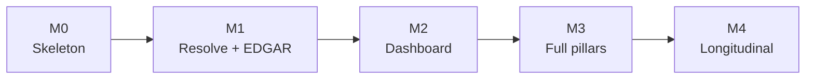

# BUILD SPEC — Company Research Skill

**For:** Claude Code, building from an empty repo.
**Goal:** a job-seeker company research tool that runs entirely inside an existing Claude
Code / Codex subscription. No server, no MCP, no API keys, no hosting.

Read §1–§4 fully before writing any code. Build in the order given in §10.

---

## 1. Objective

User provides a job description URL (or company name + market). The tool researches the
company across up to twelve dimensions using free, keyless sources, writes a structured
evidence file, and renders a single static HTML dossier with a verdict the user can
re-weight against their own priorities.

**Hard constraints:**

| Constraint | Meaning for implementation |
|---|---|
| No server | No daemon, no MCP, no persistent process. Scripts are one-shot CLIs. |
| No paid APIs | Every source must be keyless or free-signup. Fail closed if a key is missing. |
| Two markets | India and US, first-class. Neither is a special case of the other. |
| Local only | Nothing leaves the machine except source fetches. No telemetry, no upload. |
| Agent is the runtime | Scripts do deterministic work; the model does judgment. |

**Division of labour — apply this rule when unsure where logic belongs:**

> If the output is identical every time given the same input, it goes in a script.
> Otherwise it goes in the skill and the model does it.

Scripts: EDGAR pagination, CSV filtering, CDX queries, snapshot diffing, HTML rendering.
Model: source selection, entity disambiguation, reading between the lines, narrative.

---

## 2. Non-goals

Do not build these. They are deliberate exclusions, not oversights.

- **Any LinkedIn scraping, cookie handling, or headless-browser session reuse.** Out of
  scope permanently. If a pillar needs it, mark the pillar `gap`.
- **A database.** Plain files only. JSON, JSONL, and cached raw documents on disk.
- **An MCP server or wrapper layer.** The agent calls scripts via Bash directly.
- **An LLM call from inside any script.** Scripts are deterministic. No API keys anywhere.
- **A web server for the dashboard.** Single static HTML file, opened with `file://`.
- **A comp estimator for India.** No free structured source exists. Mark it `gap`.
- **Auth, user accounts, multi-user anything.**

---

## 3. Resolved decisions

These were open; they are now closed. Do not revisit.

| Question | Decision | Rationale |
|---|---|---|
| Skill structure | Directory: lean `SKILL.md` router + `references/*.md` loaded on demand | Subagents load only their pillar; main file stays scannable |
| Snapshot scheduling | Opportunistic by default (every dossier run snapshots that company) + optional watchlist cron | Zero setup for the common case; data accumulates naturally |
| Signal set | 14 signals across 5 priority dimensions, §6 | Enough to be meaningful, few enough to source reliably |
| Cache TTL | Per source class, §11.3 | Filings are stable, news is not |
| Licence | MIT | AGPL copyleft never triggers for a locally-run tool; adoption is the goal |

---

## 4. File tree

Create exactly this.

```
company-research/
├── LICENSE                              MIT
├── README.md                            install, usage, 2 example dossiers
├── AGENTS.md                            Codex / non-skill-host equivalent of SKILL.md
├── pyproject.toml                       stdlib + httpx only; no heavy deps
├── skills/
│   └── company-research/
│       ├── SKILL.md                     router, <200 lines
│       └── references/
│           ├── entity-resolution.md
│           ├── overview.md
│           ├── news.md
│           ├── hiring-trend.md
│           ├── culture.md
│           ├── compensation.md
│           ├── reviews.md
│           ├── interview-prep.md
│           ├── financial-health.md
│           ├── interviewers.md
│           ├── jd-gap.md
│           └── evidence-schema.md
├── schemas/
│   └── evidence.schema.json             JSON Schema, draft 2020-12
├── scripts/
│   ├── common.py                        http client, cache, rate limit, UA
│   ├── resolve.py
│   ├── edgar.py
│   ├── india_filings.py
│   ├── h1b.py
│   ├── wayback_jobs.py
│   ├── snapshot.py
│   ├── merge.py
│   ├── render.py
│   ├── doctor.py
│   └── install_skill.py                 symlink skill into host's skills dir
├── templates/
│   └── dossier.html                     single file, inlined CSS + JS
└── tests/
    ├── fixtures/                        recorded HTTP responses
    ├── test_resolve.py
    ├── test_merge.py
    ├── test_render.py
    └── test_signals.py
```

User data (created at runtime, never in the repo):

```
~/.company-research/
├── profile.yaml
├── watchlist.txt
├── cache/{domain}/{sha256}.json
├── snapshots/{domain}/careers.jsonl
└── dossiers/{domain}-{YYYY-MM-DD}/
    ├── evidence/{pillar}.json           subagent fragments
    ├── evidence.json                    merged
    └── dossier.html
```

---

## 5. Evidence schema

Canonical contract. Subagents write fragments, `merge.py` assembles, `render.py` consumes,
the dashboard computes the verdict from `signals`. Write `schemas/evidence.schema.json` to
match this exactly and validate in `merge.py`.

```json
{
  "meta": {
    "generated_at": "2026-08-26T09:12:00Z",
    "stage": "applying | interviewing | offer",
    "spec_version": "1.0.0"
  },
  "entity": {
    "brand": "Acme Corp",
    "domain": "acme.com",
    "resolved_entity_id": "in:U72200KA2011PTC057123",
    "employment_type": "direct | gcc | vendor | unknown",
    "confidence": 0.91,
    "tree": {
      "brand": { "wikidata_qid": "Q12345", "aliases": ["Acme", "Acme Technologies"] },
      "entities": [
        { "id": "us:0001652044", "jurisdiction": "US", "legal_name": "Acme Inc",
          "cik": "0001652044", "ticker": "ACME" },
        { "id": "in:U72200KA2011PTC057123", "jurisdiction": "IN",
          "legal_name": "Acme India Pvt Ltd", "cin": "U72200KA2011PTC057123" }
      ]
    }
  },
  "query": {
    "role": "Senior Backend Engineer",
    "level_guess": "L5 / SDE-3",
    "market": "IN",
    "city": "Bengaluru",
    "jd_url": "https://...",
    "jd_text_path": "~/.company-research/dossiers/.../jd.txt"
  },
  "sources": [
    { "id": "s1", "url": "https://www.sec.gov/...", "publisher": "SEC EDGAR",
      "type": "filing | news | forum | review | posting | dataset | company_site",
      "published_at": "2026-02-14", "retrieved_at": "2026-08-26T09:04:00Z" }
  ],
  "pillars": {
    "<pillar_name>": {
      "status": "ok | partial | gap",
      "entity_id": "in:U72200KA2011PTC057123",
      "claims": [
        { "id": "overview.0",
          "text": "Revenue concentrated in two enterprise customers, flagged as a risk factor.",
          "source_ids": ["s1"],
          "confidence": "high | medium | low" }
      ],
      "gaps": [
        { "reason": "no free structured source for Indian comp",
          "suggested_fallback": "web search AmbitionBox/Levels for this title" }
      ]
    }
  },
  "signals": {
    "<signal_id>": {
      "value": 2,
      "confidence": "high | medium | low | none",
      "source_ids": ["s7"],
      "note": "optional one-line explanation"
    }
  },
  "narrative": {
    "summary": "3-5 sentences. Every factual assertion must cite a claim id.",
    "strengths": [{ "text": "...", "claim_ids": ["overview.0"] }],
    "concerns": [{ "text": "...", "claim_ids": ["culture.3"] }],
    "questions_to_ask": ["..."]
  }
}
```

**Pillar names (fixed set):** `overview`, `news`, `hiring_trend`, `culture`,
`compensation`, `reviews`, `interview_prep`, `financial_health`, `interviewers`, `jd_gap`.

**Rules enforced by `merge.py`:**

- Every `source_ids` entry must exist in `sources`. Unknown ref → validation error.
- Every `claim_ids` entry in `narrative` must exist in some pillar. Unknown ref → error.
- A pillar with zero claims must have `status: "gap"` and at least one entry in `gaps`.
- `signals` with `confidence: "none"` must have `value: null`.
- Missing pillars are allowed (stage gating). Missing signals are allowed.

**Why claims and signals are separate:** claims are prose for humans; signals are numbers
for the verdict. Keeping them apart is what lets the browser compute the score while the
model only extracts. Do not merge them.

---

## 6. Signal registry

Fourteen signals. Each maps to one priority dimension. `render.py` embeds this table into
the dashboard as the normalization config.

| id | dimension | direction | raw type | normalization → 0..1 |
|---|---|---|---|---|
| `layoff_events_24m` | stability | lower better | int | 0→1.0, 1→0.6, 2→0.3, ≥3→0.1 |
| `funding_months_ago` | stability | lower better | int (private only) | <12→1.0, <24→0.7, <36→0.4, ≥36→0.15 |
| `revenue_trend` | stability | higher better | enum growing/flat/declining | 1.0 / 0.5 / 0.1 |
| `role_repost_count_12m` | stability | lower better | int | 1→1.0, 2→0.7, 3→0.4, ≥4→0.15 |
| `hiring_velocity_90d` | growth | higher better | float (net Δ openings / baseline) | clamp(0.5 + v, 0, 1) |
| `headcount_trend_12m` | growth | higher better | float (fractional Δ) | clamp(0.5 + 2v, 0, 1) |
| `comp_percentile_vs_market` | comp | higher better | int 0–100 | v / 100 |
| `comp_transparency` | comp | higher better | bool | 1.0 / 0.0 |
| `rating_current` | wlb | higher better | float 1–5 | clamp((v − 2.5) / 2.0, 0, 1) |
| `rating_trend_24m` | wlb | higher better | float Δ | clamp(0.5 + v, 0, 1) |
| `wlb_sentiment` | wlb | higher better | float −1..1 | (v + 1) / 2 |
| `eng_output_signal` | learning | higher better | float 0–1 | identity |
| `stack_currency` | learning | higher better | float 0–1 | identity |
| `sponsorship_history_3y` | logistics | higher better | int | 0→0.0, 1–9→0.5, 10–49→0.8, ≥50→1.0 |

**Dimensions:** `stability`, `comp`, `wlb`, `learning`, `growth`, `logistics`.

**Verdict computation (client-side JS, in `dossier.html`):**

```
for each dimension d:
    available = signals in d with confidence != "none"
    if available is empty: dimension_score[d] = null
    else: dimension_score[d] = mean(normalize(s) for s in available)

weights = user priority sliders, normalized to sum 1.0
scored_dims = dimensions where dimension_score is not null
verdict = sum(dimension_score[d] * weights[d] for d in scored_dims)
          / sum(weights[d] for d in scored_dims)

coverage = count(signals with confidence != "none") / 14
```

Render as: score out of 10, per-dimension bar breakdown, and the literal string
`"computed from N of 14 signals"`. Never hide missing data behind an average.

`sponsorship_history_3y` is only included in the weighted score when
`profile.work_authorization` indicates sponsorship is required; otherwise it renders as
informational only.

---

## 7. Script specifications

All scripts: `python scripts/X.py --help` works, output is JSON to stdout, errors to stderr
with non-zero exit, `--cache-dir` defaults to `~/.company-research/cache`.

### `common.py`
- `http_get(url, *, ttl_seconds, headers=None) -> Response` with on-disk cache keyed by
  `sha256(url)`, per-domain token bucket (default 2 req/sec, 10 for SEC), retry with
  exponential backoff on 429/5xx (3 attempts).
- Default User-Agent: `company-research/{version} (+https://github.com/<org>/company-research)`.
  SEC requires a contact address appended; read from `profile.yaml` or env
  `CR_CONTACT_EMAIL`, and fail with a clear message if absent.
- `extract_text(html) -> str` — try `https://r.jina.ai/{url}` first, fall back to a local
  readability-style extractor. Never require the remote path.
- `cache_ttl(source_class) -> int` — see §11.3.

### `resolve.py`
```
python scripts/resolve.py --name "Acme" [--domain acme.com] [--market IN] [--jd-url URL]
```
Returns the `entity` object from §5. Resolution order:
1. If `--jd-url`, fetch it and extract domain from canonical URL + legal name from footer
2. Wikidata `wbsearchentities` → QID → SPARQL for subsidiaries, tickers, country
3. US: SEC company_tickers.json → CIK
4. India: search MCA/registry sources for CIN by legal name
5. Emit `confidence`; if < 0.7, populate `candidates[]` instead of resolving

Never guess between candidates. The skill instructs the model to ask.

### `edgar.py`
```
python scripts/edgar.py --cik 0001652044 [--items 1,1A] [--forms 10-K,8-K] [--limit 3]
```
Uses `https://data.sec.gov/submissions/CIK{cik}.json` for the filing index, fetches the
primary document, extracts requested Item sections. Item 1 (Business) and Item 1A (Risk
Factors) are the highest-value sections — Item 1A is the company enumerating its own
problems under legal obligation.

### `india_filings.py`
```
python scripts/india_filings.py --name "Acme India Pvt Ltd" [--cin ...] [--limit 10]
```
BSE/NSE corporate announcements for listed entities; annual report PDF discovery. For
unlisted private companies, return `status: gap` with a clear reason rather than guessing.

### `h1b.py`
```
python scripts/h1b.py --employer "ACME INC" [--title "SOFTWARE ENGINEER"] [--year 2025] [--state CA]
```
DOL LCA disclosure data. On first run, download the quarterly file to
`~/.company-research/cache/h1b/` (it is large; report progress). Return percentiles, count,
and per-title breakdown. Also powers `sponsorship_history_3y`.

Verify the current download URL at runtime from
`https://www.dol.gov/agencies/eta/foreign-labor/performance` rather than hardcoding it.

### `wayback_jobs.py`
```
python scripts/wayback_jobs.py --domain acme.com [--path /careers] [--from 2024-01]
```
CDX API: `http://web.archive.org/cdx/search/cdx?url={domain}/careers*&output=json&from=...`
Fetch a sample of snapshots, count job postings per snapshot, return a time series. This is
the only retroactive hiring-trend source that exists for free.

### `snapshot.py`
```
python scripts/snapshot.py --domain acme.com [--careers-url URL]
```
Appends one line to `~/.company-research/snapshots/{domain}/careers.jsonl`:
`{"ts": ..., "count": N, "roles": [{"title","location","posted_id","first_seen"}]}`.
Idempotent per day. Called automatically at the end of every dossier run. Also driven by
`watchlist.txt` if the user sets up a cron.

Computes `role_repost_count_12m` by matching normalized title+location across snapshots and
counting disappear/reappear cycles.

### `merge.py`
```
python scripts/merge.py --dir ~/.company-research/dossiers/acme.com-2026-08-26
```
Reads `evidence/*.json`, validates each against the schema, dedupes `sources` by URL,
rewrites `source_ids`, enforces the rules in §5, writes `evidence.json`. Exits non-zero
with a precise error listing any dangling reference.

### `render.py`
```
python scripts/render.py --evidence path/to/evidence.json [--out dossier.html]
```
Loads `templates/dossier.html`, injects `evidence.json` and the §6 signal registry as two
`<script type="application/json">` blocks, writes a self-contained file. No network, no CDN
references, no build step.

### `doctor.py`
```
python scripts/doctor.py
```
Probes every source, reports live/degraded/dead with the failing reason and a fix hint.
Borrowed from Agent-Reach; it is the single best affordance that project has. Exit 0 if all
core sources are live.

---

## 8. Skill structure

### `SKILL.md` — router only, under 200 lines

Contents, in order:
1. **When to use** — triggers: company research, interview prep, offer evaluation, "should
   I apply to X"
2. **Preflight** — read `~/.company-research/profile.yaml`; if absent, ask the §9 first-run
   questions and write it
3. **Inputs** — ask for JD URL (preferred) or company + market; ask for stage. Never ask
   more than two questions before starting work.
4. **Resolve** — run `resolve.py`. If `confidence < 0.7` or `employment_type == "unknown"`
   and market is IN, ask the user to disambiguate. Load `references/entity-resolution.md`.
5. **Stage gate** — pick the pillar set from the table below
6. **Fan out** — spawn one subagent per pillar. Each is told: its pillar name, the
   `entity_id` to bind to, the path to write, and to load `references/{pillar}.md` first.
7. **Merge and render** — `merge.py` then write `narrative` then `render.py`
8. **Snapshot** — always run `snapshot.py` at the end, regardless of stage
9. **Present** — give the user the file path and a 3-sentence summary. Do not restate the
   dossier in chat.

**Stage gating:**

| Stage | Pillars |
|---|---|
| `applying` | overview, news, financial_health, culture, hiring_trend |
| `interviewing` | overview, interview_prep, jd_gap, interviewers, culture, news |
| `offer` | compensation, financial_health, reviews, hiring_trend, culture |

### `references/{pillar}.md` — one per pillar, loaded on demand

Each contains: which sources in priority order, exact script invocations, what a good claim
looks like for that pillar, which signals to populate, when to declare `gap`, and
pillar-specific traps (e.g. interview questions older than 18 months are actively
misleading; review ratings must be reported as a trend, not a snapshot).

Keep each under 100 lines. A subagent should load exactly one.

### `references/evidence-schema.md`
Human-readable companion to the JSON Schema, with a complete filled example. Every subagent
loads this plus its own pillar doc.

---

## 9. Profile and first run

`~/.company-research/profile.yaml`, written after the first successful run:

```yaml
contact_email: user@example.com      # required by SEC fair-access policy
resume_path: ~/docs/resume.pdf
base_market: IN
work_authorization:
  US: requires_sponsorship           # or: authorized / not_applicable
  IN: citizen
seniority_band: senior
current_comp:
  currency: INR
  annual: 4200000                    # optional, offer stage only
priorities:                          # ranked; becomes default slider weights
  - stability
  - comp
  - learning
  - wlb
  - growth
```

First-run questions, asked conversationally, maximum four:
1. Contact email (explain: SEC requires it in the User-Agent; it is never sent anywhere else)
2. Base market and work authorization
3. Resume path (optional, skippable)
4. Priority ranking

Everything else is derived or asked conditionally later.

---

## 10. Build order

Each milestone must pass its acceptance test before starting the next.



### M0 — Skeleton
Repo tree, `pyproject.toml`, `common.py` with cache + rate limit + UA, `doctor.py` probing
three sources, MIT LICENSE, `install_skill.py`.
**Accept:** `python scripts/doctor.py` reports live status for SEC, Wikidata, GDELT.

### M1 — Resolve and overview
`resolve.py`, `edgar.py`, `india_filings.py`, the evidence schema, `merge.py`, and
`SKILL.md` + `references/entity-resolution.md`, `overview.md`, `news.md`,
`evidence-schema.md`.
**Accept:** end to end for one US public company and one Indian listed company, producing a
schema-valid `evidence.json` with ≥5 cited claims each, using only the skill and Bash. No
dashboard yet.

### M2 — Dashboard and verdict
`templates/dossier.html`, `render.py`, the full §6 signal registry with client-side scoring
and priority sliders.
**Accept:** open the file with no network; drag a slider and watch the verdict change; every
claim card links to a source with a date; a pillar with `status: gap` renders an explicit
empty state; the header reads `computed from N of 14 signals`.

### M3 — Remaining pillars
`culture`, `reviews`, `interview_prep`, `financial_health`, `interviewers`, `jd_gap`,
`compensation` (US via `h1b.py`, India as `gap`). Subagent fan-out in `SKILL.md`.
**Accept:** all three stages produce correct pillar sets; a role with no free comp source
still renders a complete dossier.

### M4 — Longitudinal
`snapshot.py`, `wayback_jobs.py`, `role_repost_count_12m`, `hiring_velocity_90d`,
watchlist cron installer.
**Accept:** `wayback_jobs.py` returns a ≥12-month job-count series for a known company;
`snapshot.py` is idempotent within a day and detects a reposted role across two synthetic
snapshots.

---

## 11. Conventions

### 11.1 Failure handling
Never raise on a single dead source. Return partial results plus a failure list; the schema
already models this via `status` and `gaps`. A tool that raises on one dead source produces
nothing on a Tuesday.

### 11.2 Rate limiting and identification
Per-domain token bucket in `common.py`. SEC allows 10 req/sec and requires a contact
address in the User-Agent. Everything else defaults to 2 req/sec. Respect `robots.txt` by
default with an explicit `--ignore-robots` escape hatch that is never used by the skill.

This is self-interested, not just polite: an open-source tool that hammers sites gets its
entire user base IP-banned collectively.

### 11.3 Cache TTL by source class

| Class | TTL |
|---|---|
| entity resolution | 90 days |
| filings | 30 days |
| compensation datasets | 30 days |
| reviews | 7 days |
| github | 7 days |
| interview reports | 14 days |
| news | 6 hours |
| careers snapshots | never expire (append-only) |

Raw fetched bodies are kept indefinitely (they are small and cheap); re-extract from cache
rather than re-fetching.

### 11.4 Testing
Record HTTP fixtures into `tests/fixtures/` and replay them. The default test run must never
touch the network. Add a `--live` marker for an opt-in suite used by the nightly canary.

Nightly CI runs `doctor.py` against live sources and opens a labelled issue when a source
returns zero or malformed results. Contributors fix what is visibly red; they do not fix
what is silently broken.

---

## 12. Source reference

Verify endpoints at runtime where noted; these change.

| Source | Endpoint | Notes |
|---|---|---|
| SEC submissions | `https://data.sec.gov/submissions/CIK{10-digit}.json` | UA with contact required |
| SEC ticker map | `https://www.sec.gov/files/company_tickers.json` | CIK ↔ ticker |
| SEC full-text | `https://efts.sec.gov/LATEST/search-index?q=` | 2001+ |
| Wikidata search | `https://www.wikidata.org/w/api.php?action=wbsearchentities` | free |
| Wikidata SPARQL | `https://query.wikidata.org/sparql` | subsidiaries, tickers |
| GDELT | `https://api.gdeltproject.org/api/v2/doc/doc?query=&mode=artlist&format=json` | global news |
| Google News RSS | `https://news.google.com/rss/search?q=` | per-query |
| HN Algolia | `https://hn.algolia.com/api/v1/search?query=` | tech sentiment |
| Wayback CDX | `http://web.archive.org/cdx/search/cdx?url=&output=json&from=` | job history |
| Jina Reader | `https://r.jina.ai/{url}` | clean markdown, keyless |
| DOL H-1B | discover from `https://www.dol.gov/agencies/eta/foreign-labor/performance` | quarterly bulk |
| GitHub | `https://api.github.com` | token optional, raises rate limit |

**Known permanent gap:** India compensation. AmbitionBox is Naukri-owned and scrape-hostile;
Indian postings rarely publish ranges. Mark `compensation` as `gap` for `market: IN` with
`suggested_fallback` pointing the model at its own web search. Do not build an estimator.

---

## 13. README requirements

The README is load-bearing for adoption. It must contain, in this order:

1. One-sentence description and a screenshot of a rendered dossier
2. Install: `git clone` + `python scripts/install_skill.py` — **no remote script execution,
   no piping a URL to a shell**
3. Usage: a single example prompt the user pastes to Claude Code
4. Two complete example dossiers committed to the repo — one Indian company, one US — so
   value is visible before anyone installs
5. An explicit statement of what the tool does not do (§2), especially the LinkedIn
   exclusion
6. Source list with the honest coverage gaps marked
