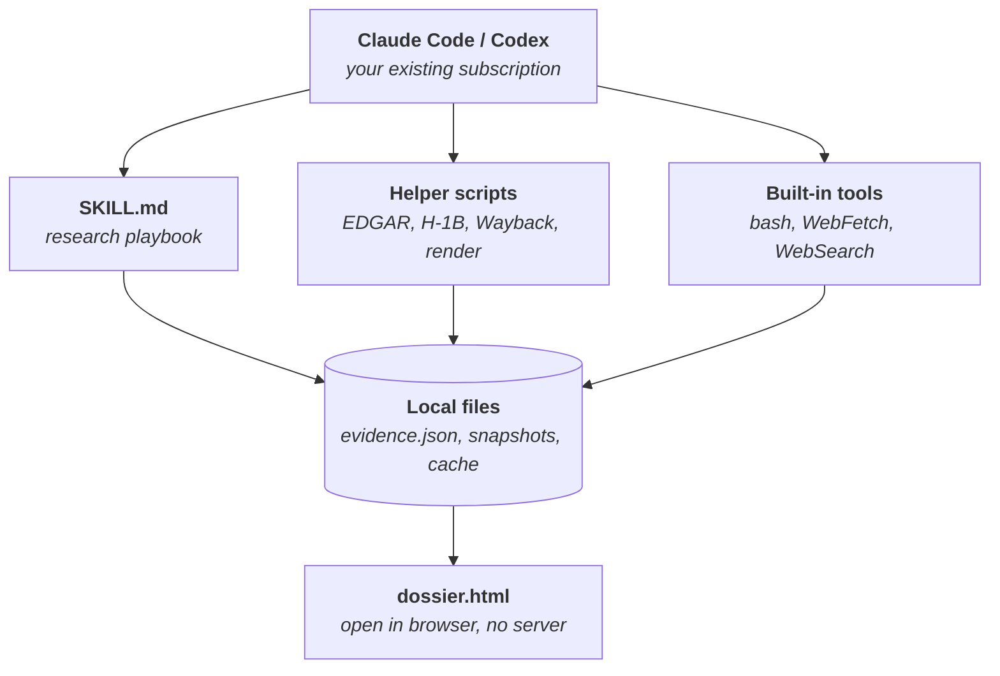
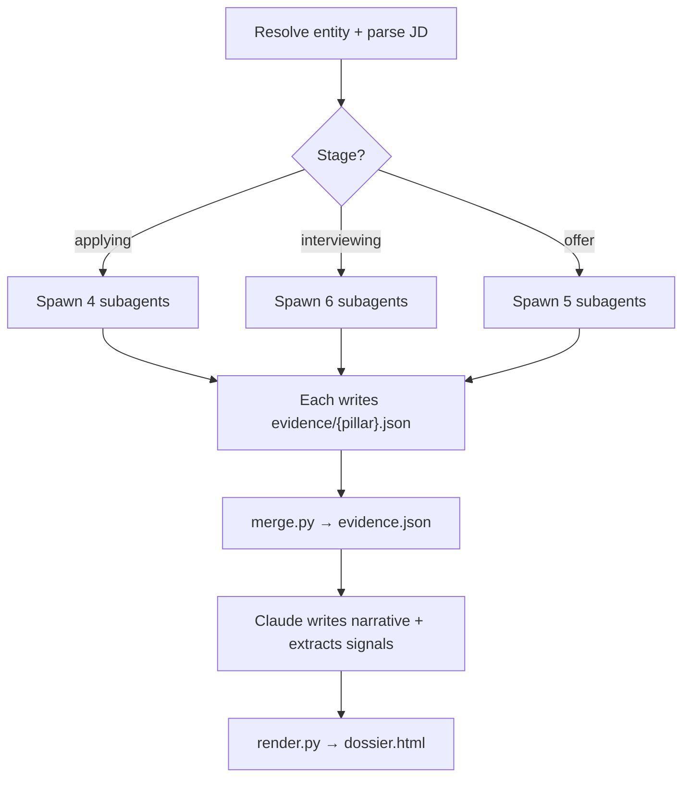
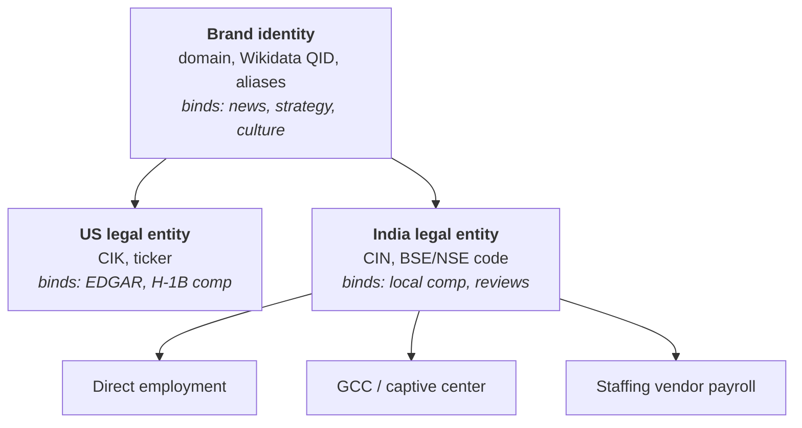
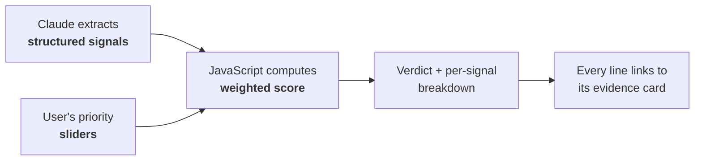

# Company Research Skill — Design Notes

A job-seeker research tool that runs entirely inside an existing Claude Code or Codex
subscription. No server, no MCP daemon, no API keys, no hosting.

Status: design, pre-implementation. Supersedes the earlier MCP-server design.

---

## 1. What it does

A user is applying for a role. They give the agent a job description URL (or a company name
plus market) and get back an interactive HTML dossier, grounded in cited sources, ending in
a verdict computed against their own stated priorities.

**Core pillars:**

1. What the company does, from a joining/interviewing perspective
2. Recent news and articles
3. Hiring history and trend
4. Work culture
5. Pay range for the role
6. Reviews aggregated across platforms
7. Interview process and recent question patterns
8. People signals (recent joiners, referral paths) — *deferred, see §11*

**Additions surfaced during design that rank above some of the originals:**

9. **Financial health and layoff risk** — "will this company exist in 18 months" outranks
   culture scores for most candidates
10. **Interviewer research** — paste the calendar invite names, get their talks, papers,
    GitHub, posts. Highest-leverage 10 minutes of prep available.
11. **JD × resume gap analysis** — the JD was originally an optional input; it is in fact
    the highest-signal one the tool receives
12. **Red-flag detection from longitudinal data** — a role reposted four times in eight
    months means something is wrong with that team or manager

---

## 2. The core architectural decision

**Claude Code is already the runtime.** It has Bash, WebFetch, WebSearch, Read/Write and
subagents. Every primitive this project needs already exists inside the subscription.
Building an MCP server on top would mean standing up a second runtime beside the one that
already works.

What is actually missing is not plumbing. It is the **playbook**: which sources in what
order, that Zomato resolves to Eternal Ltd, that DOL H-1B data answers US comp for free,
that a repeatedly reposted role is a red flag, when to stop searching. That is knowledge,
and a skill file is the right container for knowledge.

This is the same shape as [Agent-Reach](https://github.com/Panniantong/Agent-Reach):
install a CLI, register a SKILL.md, get out of the way. It describes itself as a capability
layer that handles selection, installation, health-checking and routing, while the agent
calls upstream tools directly with no wrapper in between.



### 2.1 Why not MCP

An MCP server earns its place when you need persistent connections, auth handling, or a
fixed tool surface discoverable across many hosts. None of that applies here. The costs are
real: a config file to edit before anything works, a process to keep alive, a second place
for bugs to live, and tool descriptions consuming context on every turn.

The skill costs one file read.

### 2.2 Division of labour

| Scripts handle | Claude handles |
|---|---|
| Anything that burns tokens (filtering a 200MB H-1B CSV) | Which sources matter for *this* role |
| Anything needing exactness (EDGAR pagination, CDX queries) | Reading between the lines of reviews |
| Anything deterministic (snapshot diffing, HTML rendering) | Resolving ambiguous entities |
| Anything scheduled (weekly cron) | Writing the narrative verdict |

Rule of thumb: if the output is the same every time given the same input, it belongs in a
script. Otherwise it belongs in the model.

---

## 3. Repository layout

```
company-research/
├── skills/company-research/
│   └── SKILL.md                 the playbook
├── scripts/
│   ├── resolve.py               name → {domain, CIK, CIN, aliases, tree}
│   ├── edgar.py                 10-K Item 1 / 1A extraction
│   ├── india_filings.py         BSE/NSE announcements, annual reports
│   ├── h1b.py                   filter DOL bulk data by employer + title
│   ├── wayback_jobs.py          CDX → historical job counts
│   ├── snapshot.py              weekly careers-page capture (cron)
│   ├── merge.py                 subagent fragments → evidence.json
│   └── render.py                evidence.json → dossier.html
├── templates/
│   └── dossier.html             single file, inlined CSS/JS
├── AGENTS.md                    for Codex and non-skill hosts
└── README.md                    with two example dossiers
```

User data lives outside the repo:

```
~/.company-research/
├── profile.yaml                 written on first successful run
├── cache/{domain}/              raw fetched documents, content-addressed
├── snapshots/{domain}/          weekly careers-page captures, JSONL
└── dossiers/{domain}-{date}/
    ├── evidence.json
    └── dossier.html
```

No SQLite. Plain files are enough, and they are greppable, git-friendly and free of schema
migrations. The one place a database would help — longitudinal snapshots — is served fine
by append-only JSONL.

---

## 4. Subagent orchestration

Claude Code can spawn parallel subagents. This is a real advantage of staying inside the
host rather than building a server, and the skill should be designed around it.



Each subagent gets one pillar, a fixed output schema, and a small clean context. The merge
is trivial because the schema is fixed. Eight pillars researched concurrently instead of
serially, and no single context has to hold everything.

The stage gate matters: it decides how many subagents spawn at all. See §7.2.

---

## 5. Entity resolution

The hardest part of the project, and the one that fails silently. A company is not one
thing.



Someone interviewing at Google India needs India comp and India reviews, but US strategy
and US financials. Bind the wrong pillar to the wrong level and the dossier is subtly,
plausibly wrong — the worst possible failure mode for something you walk into an interview
carrying.

**Rules:**

- `resolve.py` returns the full tree plus a confidence score
- Every pillar records which `entity_id` its claims are about
- Low confidence returns a disambiguation list; the skill instructs Claude to ask rather
  than guess
- The **India employment-type branch matters as much as the country branch.** A "Google"
  role in Hyderabad might be Google India, a captive center with different levels and comp,
  or a vendor payroll with a badge that expires. Three different comp bands, three review
  pools, three interview loops. Market input does not disambiguate this.

Known traps: Zomato is legally Eternal Ltd. Google is Alphabet, Google LLC and Google India
Pvt Ltd depending on source. Common brand names (Apex, Nexus, Sigma) collide across
jurisdictions.

---

## 6. Evidence schema

The load-bearing piece. Subagents write fragments of it, `merge.py` assembles it,
`render.py` reads it, and the verdict computes from it.

```json
{
  "meta": {
    "generated_at": "2026-08-26T09:12:00Z",
    "stage": "interviewing",
    "skill_version": "0.3.0"
  },
  "entity": {
    "brand": "Acme Corp",
    "domain": "acme.com",
    "resolved_entity_id": "in:U72200KA2011PTC057123",
    "employment_type": "gcc",
    "confidence": 0.91,
    "tree": { "...": "full resolution tree" }
  },
  "query": {
    "role": "Senior Backend Engineer",
    "market": "IN",
    "city": "Bengaluru",
    "jd_url": "https://..."
  },
  "sources": [
    {
      "id": "s1",
      "url": "https://www.sec.gov/...",
      "publisher": "SEC EDGAR",
      "type": "filing",
      "published_at": "2026-02-14",
      "retrieved_at": "2026-08-26T09:04:00Z"
    }
  ],
  "pillars": {
    "overview": {
      "status": "ok",
      "claims": [
        {
          "text": "Revenue concentrated in two enterprise customers, flagged as a risk factor.",
          "source_ids": ["s1"],
          "confidence": "high"
        }
      ]
    },
    "compensation": {
      "status": "gap",
      "claims": [],
      "gaps": [{
        "reason": "no free structured source for Indian comp",
        "suggested_fallback": "web search AmbitionBox/Levels for this title"
      }]
    }
  },
  "signals": {
    "layoff_events_24m":        { "value": 2,    "confidence": "high",   "source_ids": ["s7","s8"], "direction": "lower_better" },
    "rating_trend_slope":       { "value": -0.4, "confidence": "medium", "source_ids": ["s11"],     "direction": "higher_better" },
    "role_repost_count":        { "value": 4,    "confidence": "high",   "source_ids": ["s14"],     "direction": "lower_better" },
    "hiring_velocity_90d":      { "value": 0.12, "confidence": "medium", "source_ids": ["s14"],     "direction": "higher_better" },
    "funding_months_ago":       { "value": 31,   "confidence": "high",   "source_ids": ["s3"],      "direction": "lower_better" },
    "comp_percentile_vs_market":{ "value": null, "confidence": "none",   "source_ids": [],          "direction": "higher_better" },
    "sponsorship_history_3y":   { "value": 47,   "confidence": "high",   "source_ids": ["s9"],      "direction": "higher_better" }
  },
  "narrative": {
    "verdict_summary": "...",
    "claim_refs": ["overview.0", "culture.3"]
  }
}
```

**Two conventions carried over from the MCP design, now expressed in the schema:**

- **`status: "gap"` replaces `coverage_gaps`.** Free-only plus two markets means uneven
  coverage. Pretending otherwise is how you ship a confidently wrong salary band. A pillar
  that declares itself empty lets the agent fall back to plain web search, and lets the
  dashboard render an honest empty state instead of a fabricated one.
- **Low-confidence resolution triggers a question, not a guess.** The skill instructs
  Claude to ask conversationally rather than proceed. No forms, no config editing.

**Signals are separate from claims on purpose.** Claims are prose for humans. Signals are
numbers for the verdict. Keeping them apart is what makes §8 possible.

---

## 7. Inputs

Every question is an adoption tax. A ten-field intake form kills an OSS tool. Since the
agent is conversational, ask progressively and store what is reusable.

| Tier | When | Contents |
|---|---|---|
| **Profile** | Once, `~/.company-research/profile.yaml` | Resume path, base market, work authorization, seniority band, current comp, ranked priorities |
| **Per-search** | Every run (2 fields) | JD URL or paste; interview stage |
| **Conditional** | Only when a pillar needs it | Interviewer names, competing offers, employment type |
| **Derived** | Never asked | Market, city, currency, level, stack, canonical entity |

### 7.1 Ask for the JD URL, not the company name

One paste yields the domain (the canonical resolution key), the exact legal entity from the
footer, market and city, role title and level, the stack, often a posting ID, and sometimes
a comp range. It collapses six questions into one field and resolves ambiguity better than
asking "which Acme?" would. Fall back to name-plus-market only when there is no URL.

### 7.2 Ask what stage they're at

Highest-leverage single question after the JD, because it decides which subagents spawn:

| Stage | Run | Skip |
|---|---|---|
| Considering applying | Overview, red flags, financial health, culture | Interview questions |
| Interview scheduled | Process, question bank, interviewer research, JD gap | Deep comp |
| Have an offer | Comp benchmarking, layoff risk, negotiation leverage, recent-joiner reviews | Interview prep |

Same evidence store, three dossiers, each costing roughly a third of the tokens of doing
everything.

### 7.3 Profile fields that earn their place

- **Work authorization** — ties the two markets together. For an Indian candidate targeting
  US roles, sponsorship history is a pass/fail filter answerable free from DOL data. For a
  US-authorized candidate the whole query is noise. One field activates or silences an
  entire data source.
- **Ranked priorities** (comp / WLB / learning / stability / remote) — become the verdict
  weights in §8. Cheap to collect, disproportionate effect.
- **Resume** — unlocks gap analysis, STAR story mapping, referral targeting. Store a path,
  not contents.
- **Current and target comp** — offer stage only. Ask conditionally, and state that it never
  leaves the machine. That is true, and it is a concrete payoff of the local-first design.

**Deliberately not asked:** which sources to use, how far back to search, output format.
Those follow from stage and priorities. Every exposed knob is one someone will get wrong
and then file an issue about.

---

## 8. The dossier and the verdict

Single static HTML file. Data inlined as JSON in a `<script>` tag, all interactivity
client-side. Opens with `open dossier.html`. Works offline, survives forever, and a whole
job search can be committed to a private repo.

### 8.1 The verdict must not be an oracle

A confident "7.5/10, good company" is exactly where an AI judgment does the most damage:
the confidence is unearned and the reasoning is invisible.



The score is computed **in the browser**, from signals, weighted by sliders the user can
drag. Move "stability" up and the verdict moves. This does three things at once:

- **Honest** — visibly a function of their priorities, not a pronouncement
- **Auditable** — every claim traces to a source with a retrieval date
- **Plays to strengths** — Claude does extraction, which it is reliable at, rather than
  scoring, which it is not

### 8.2 Rendering rules

- Missing signals are shown as missing. The verdict reads "computed from 6 of 9 signals"
  rather than silently averaging what exists.
- Confidence is rendered per claim, not hidden.
- Every claim card shows publisher and date. Recency decay matters most for interview
  questions — a 2019 question set is actively misleading.
- Trend beats snapshot. A 4.1 rating falling from 4.5 is the story; the 4.1 is not.
- Empty pillars render an explicit "no free source covers this" panel with the suggested
  manual fallback.

---

## 9. Source inventory

Everything below is keyless or free-signup.

| Source | Key | Covers |
|---|---|---|
| SEC EDGAR | No (UA header) | US filings; 10-K Item 1 & 1A are gold for interview prep |
| BSE/NSE announcements | No | India listed-company filings, annual reports |
| SEBI DRHP/RHP | No | Pre-IPO Indian companies |
| GDELT DOC 2.0 | No | Global news, both markets |
| Google News RSS | No | Per-query news |
| HN Algolia | No | Tech sentiment, US-heavy |
| Wikidata | No | Entity graph, aliases, subsidiary structure |
| Wayback CDX | No | **Retroactive hiring trend** from archived careers pages |
| DOL H-1B LCA bulk | No | Real filed US salaries; also sponsorship history |
| GitHub REST | Token optional | Stack, cadence, org health |
| Jina Reader (`r.jina.ai/URL`) | No | Clean markdown from any page |
| Exa via mcporter | No | Semantic web search |
| SearXNG (self-hosted) | No | Metasearch, optional |
| Reddit | Free app reg | Best culture signal both markets (r/developersIndia, r/cscareerquestions) |
| layoffs.fyi dataset | No | Layoff history, US-heavy |

**Stated gap:** US comp is fully solvable free via H-1B disclosure data. India comp is
**not** — AmbitionBox is Naukri-owned and scrape-hostile, and Indian postings rarely carry
ranges. Do not ship a bad estimator; mark the pillar `gap` and delegate.

**Hiring trend:** nobody sells this retroactively. Two moves — run `snapshot.py` weekly
from day one so you own trend data within two months, and mine Wayback CDX for history you
never crawled. This is the part of the project that cannot be replicated by pointing an
agent at web search.

---

## 10. Scope boundary

Keep the repo legally boring. Ship only adapters for sources that are official APIs,
explicitly public and unauthenticated, or RSS/sitemap.

Anything requiring a login session, defeating bot detection, or violating a ToS stays out
of the repo entirely. Agent-Reach already occupies that tier and maintains it. Detect it on
PATH, delegate to it if present, mark the pillar `gap` if absent.

That keeps you from ever being the maintainer who shipped the LinkedIn scraper, while users
who want those sources opt into a separate project under its own warnings and their own
account risk.

**Do not inherit** Agent-Reach's install flow, which asks users to paste a raw GitHub URL to
their agent and let it execute the instructions. They have defended it sensibly (check-only
by default, `--system` required to touch the machine, `--dry-run` available), but a plain
`git clone` plus a skill file with no network side effects is a better front door.

**Also inherited from that project's README as a warning, not a pattern:** cookie-based
channels carry a real account-ban risk, which is why it recommends throwaway accounts. For a
job-seeker tool that is far worse than for a research tool — the user's LinkedIn *is* their
job search, and a restriction mid-cycle is catastrophic. A throwaway also defeats the
purpose, since the useful data sits behind their own network graph.

---

## 11. Roadmap

### V1 — skill + four scripts, zero keys

1. `SKILL.md` with entity resolution rules, stage gating, and the evidence schema
2. `resolve.py` — Wikidata + EDGAR CIK + India CIN, with disambiguation
3. `edgar.py` + `india_filings.py`
4. `render.py` + `templates/dossier.html` with the slider-driven verdict
5. News via built-in WebSearch and WebFetch — no script needed

Plus: **start `snapshot.py` on cron immediately**, before anything reads from it.

Ship with two example dossiers committed to the README — one Indian company, one US — so
value is visible before anyone installs.

### V2

Reviews and culture (Reddit, HN), comp (`h1b.py` for US, `gap` for India), interview
question mining, `wayback_jobs.py`, interviewer research subagent.

### V3+

Red-flag detection from accumulated snapshots, Agent-Reach delegation, AGENTS.md parity for
Codex, community source adapters.

### Deferred indefinitely

Pillar 8 (LinkedIn people data). The reframe: a job seeker does not need "who joined," they
need "who can refer me" and "who is on my panel." Safer paths exist — press releases
announce senior hires, conference talks are public, and a browser extension in the user's
own session keeps data local. None belongs in V1.

---

## 12. Surviving as an OSS project

- **Nightly canary CI** running each script against live sources, auto-opening a labelled
  issue when one returns zero or malformed results. Contributors fix what is visibly red.
- **Recorded HTTP fixtures** so the normal test suite never touches the network.
- **Partial results always.** A script that raises on one dead source produces nothing on a
  Tuesday. Return what worked plus a failure list; the schema already has `status`.
- **Per-domain rate limiting** and a User-Agent identifying the repo. Self-interested:
  OSS scrapers that hammer sites get their whole user base IP-banned collectively.
- **A `doctor` command** reporting which sources are live, borrowed directly from
  Agent-Reach. It is the single best affordance that project has.
- **Keep each script under ~150 lines** with a plain CLI. If adding AmbitionBox or Naukri is
  trivial, contributors will add Seek, Xing, Kununu, StepStone. The core value is the
  playbook, the schema and the renderer; the community builds the long tail.

---

## 13. Open questions

- SKILL.md structure — one file, or a directory with per-pillar reference docs the agent
  loads on demand?
- Signal set — which nine to fifteen signals, and normalization curves for each
- Snapshot cron packaging — bare crontab, launchd/systemd unit, or a `--watch` mode?
- Cache invalidation policy per source class
- Licence: MIT for adoption vs AGPL for protection (weak protection for a local tool)
