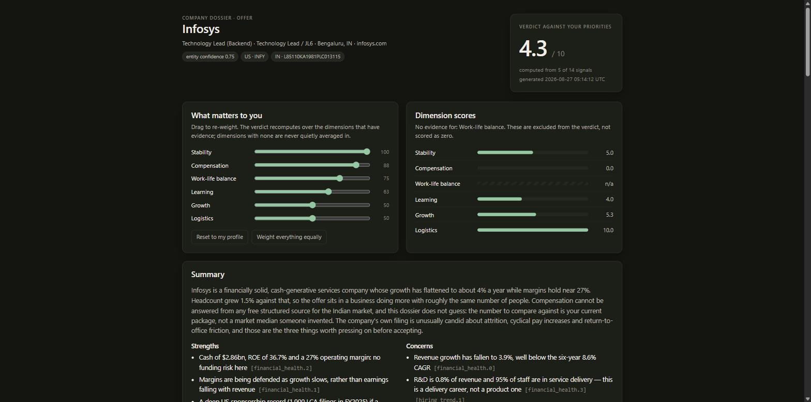

# Example dossiers

Two complete runs, committed so the output is visible before anyone installs anything.
Open the `dossier.html` files from disk — they need no server and fetch nothing.

Each directory holds exactly what a real run leaves behind:

```
evidence/<pillar>.json   the fragments each pillar produced
evidence/narrative.json  the summary, written after the merge validated
evidence.json            merged, deduplicated, validated
dossier.html             the rendered dashboard
```

## cloudflare-applying-2026-08-27

US public company, `applying` stage. 19 claims, 8 sources, 4 of 14 signals scored.

What the run found: a Form 8-K filed 2026-05-07 (Item 2.05) disclosing a plan to cut
**approximately 20% of the workforce** with $140–150m of charges — while the job board
still carried **306 open roles** in August. Both facts are cited, and the summary says
plainly that hiring and cutting are running at the same time.

It also demonstrates two failure modes handled honestly: GDELT was unreachable from the
machine during the run (recorded as a gap on the news pillar), and hiring velocity could
not be computed because it was the first local snapshot for that domain.


## infosys-offer-2026-08-27

Indian listed company, `offer` stage. 16 claims, 7 sources, 4 of 14 signals scored.

Entity resolution produced both jurisdictions from one brand — SEC CIK `0001067491` and
CIN `L85110KA1981PLC013115`, BSE scrip 500209 — which matters because the 20-F is the
richer document while the India entity is the actual employer.

The compensation pillar is the point of this example. There is no free structured source
for Indian pay, so the dossier **says so**, explains why, and tells the reader where to
look themselves. What it does provide is the US LCA data for the group (1,900 filings,
median committed base $92,581) with the caveat that it describes US worksites, plus the
observation that the filings sweep in four related employers.

`comp_transparency` is deliberately left unscored: no Indian employer publishes ranges, so
marking it `false` would have dragged the whole compensation dimension to zero on a market
norm rather than anything this company did.



## Reproducing them

The evidence is a snapshot of public sources on 2026-08-27; re-running today will produce
different numbers, which is the point of dating every claim. To re-render either dossier
from its committed evidence:

```bash
python scripts/render.py --evidence examples/cloudflare-applying-2026-08-27/evidence.json \
  --out /tmp/cloudflare.html --open
```

To re-validate the committed evidence against the schema:

```bash
python scripts/merge.py --dir examples/cloudflare-applying-2026-08-27 --check --pretty
```
